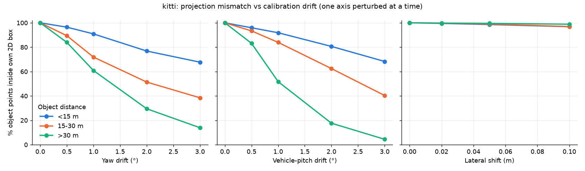
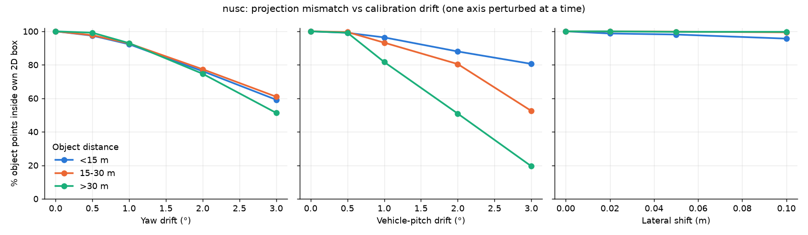
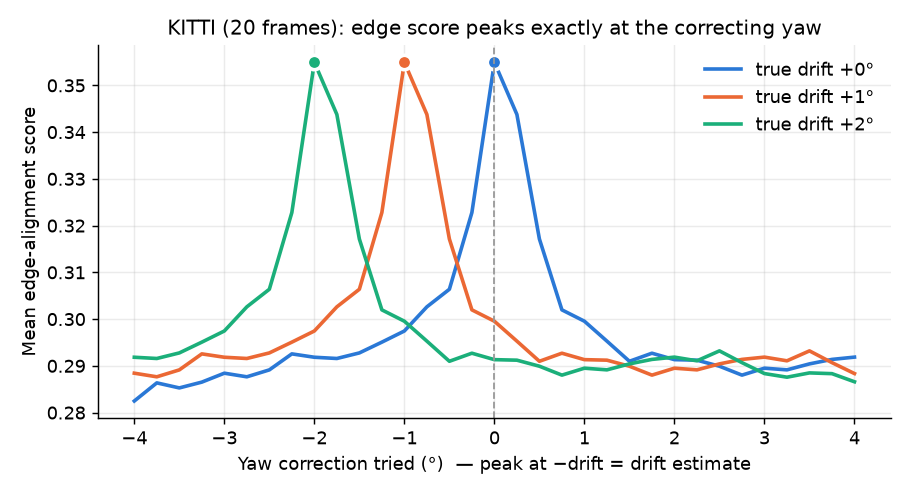
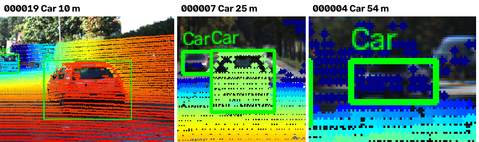
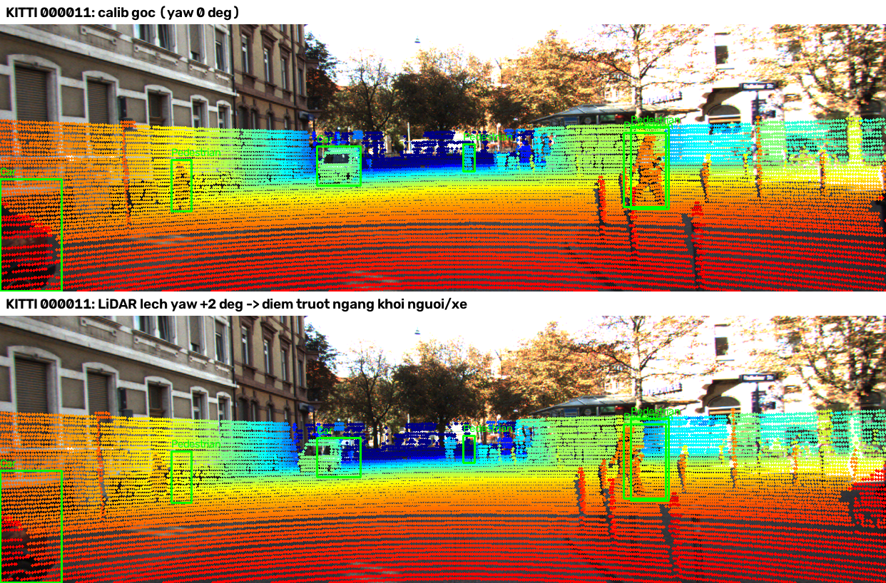
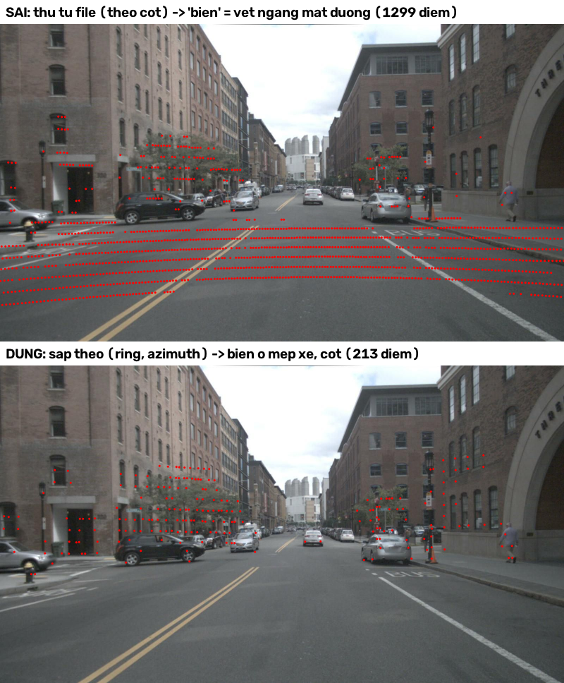
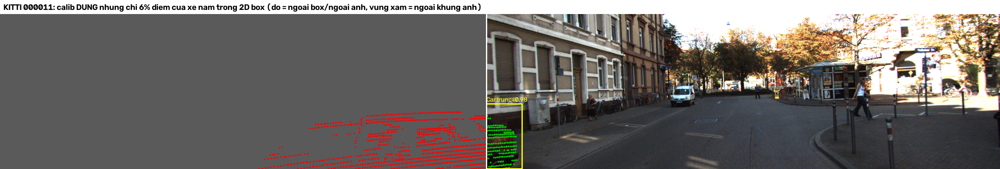

# Báo cáo Day 6: Kiểm tra calibration LiDAR-camera bằng projection

- **Họ tên:** Nguyễn Tuấn Thành
- **MSSV:** 2A202602640
- **Lớp:** VinUni AI20K — Track 4 (Computer Vision and Robotics)
- **Link repo:** https://github.com/Chika1357/NguyenTuanThanh-2A202602640-Track4-Day21
- **Topic:** A — LiDAR-camera projection QA
- **Dataset:** data/kitti_mini (chính), data/nuscenes_mini_subset (so sánh, bonus B5), data/synthetic (debug + bonus B6)
- **Các frame đã dùng:** toàn bộ 20 frame kitti_mini (000001 … 000061, 107 object có ≥ 10 điểm); toàn bộ 80 keyframe nuScenes (scene-0103_000…039 ban ngày, scene-1094_000…039 ban đêm; 292 object); synthetic 000000…000004

## 1. Claim

**Trên KITTI, lệch yaw extrinsic 1° làm 26% điểm LiDAR của object rơi ra khỏi 2D box của chính object đó (39% với object > 30 m, chỉ 9% với object < 15 m), trong khi dịch ngang 10 cm chỉ làm 2.5%. Drift yaw ≥ 0.5° phát hiện được mà không cần label bằng edge-alignment score cộng dồn trên 20 frame (sai số 0° trên KITTI, ≤ 0.25° trên nuScenes).**

Cách đo: với calib gốc, lấy các điểm nằm trong 3D box GT **và** rơi vào 2D box (tập tham chiếu), rồi chiếu lại bằng calib bị perturb và đếm % điểm còn nằm trong 2D box (`inbox_ratio`). Mỗi lần chỉ perturb **một** trục, mọi thứ khác giữ nguyên. Không có phép ngẫu nhiên nào, chạy lại cho ra đúng cùng số (đã kiểm tra bằng `diff`).

## 2. Evidence

**Thí nghiệm 1: in-box ratio theo mức drift** (`results/kitti_inbox_summary.csv`, `results/nusc_inbox_summary.csv`; số liệu từng object nằm trong `*_inbox_sweep.csv`)

| Perturb (1 trục) | KITTI: tất cả | KITTI < 15 m | KITTI > 30 m | KITTI: % object lệch (< 90%) | nuScenes: tất cả |
|---|---|---|---|---|---|
| 0 (calib gốc) | 100% | 100% | 100% | 0% | 100% |
| yaw 0.5° | 89.7% | 96.4% | 83.9% | 34% | 97.8% |
| yaw 1° | **74.0%** | 90.9% | **60.8%** | 54% | 92.7% |
| yaw 2° | 51.8% | 76.8% | 29.5% | 76% | 76.7% |
| yaw 3° | 39.2% | 67.7% | 13.9% | 85% | 59.3% |
| pitch xe 1° | 75.8% | — | — | 61% | 92.8% (*) |
| roll xe 1° | 97.1% | — | — | 10% | 99.4% (*) |
| dịch ngang 2 / 5 / 10 cm | 99.7 / 99.1 / **97.5%** | 10 cm: 96.8% | 10 cm: 98.8% | 10 cm: 9% | 99.6 / 99.3 / 98.4% |

(*) LiDAR nuScenes có x hướng sang phải, y hướng về phía trước, nên quay quanh trục y của LiDAR (`pitch_deg` trong `perturb_extrinsic`) thực ra là **roll của xe**. Bảng và plot đã đổi trục cho đúng nghĩa vật lý.




- **Xu hướng:** sai số góc (yaw, pitch) làm điểm trượt một lượng pixel gần như cố định (≈ f·tan 1° ≈ 12.6 px với f = 721 px của KITTI). Object xa có 2D box nhỏ nên mất điểm nhiều nhất. Ngược lại, sai số dịch chuyển gây lệch f·t/z pixel, nên object **gần** bị ảnh hưởng nhiều hơn, nhưng 10 cm vẫn chỉ mất 2.5%.
- **So sánh 2 dataset (B5):** nuScenes ít nhạy hơn (yaw 1°: 92.7% so với 74.0%) vì (1) 2D box của nuScenes được suy ra từ 8 góc của 3D box nên rộng hơn box vẽ tay sát object của KITTI, và (2) phần lớn object nuScenes nằm ở 15–30 m. Riêng ở nuScenes, object > 30 m chỉ tách hẳn khỏi các nhóm khác ở trục pitch, còn ở trục yaw thì 3 nhóm khoảng cách gần như trùng nhau. Mình chưa kiểm chứng nguyên nhân, giả thuyết là box nuScenes (suy ra từ 3D) có biên ngang rộng hơn biên dọc.

**Thí nghiệm 2: phát hiện drift không cần label (Advanced)** (`results/*_edge_drift.csv`)

Lấy các điểm LiDAR ở mép bước nhảy độ sâu và so với cạnh Canny của ảnh: score = mean(exp(−d/2 px)), với d là khoảng cách tới cạnh gần nhất. Quét yaw thử trong [−4°, 4°], bước 0.25°, rồi lấy yaw cho score lớn nhất làm ước lượng drift.

| Dataset | % frame đơn lẻ ước lượng đúng ±0.25° | Ước lượng cộng dồn cả cửa sổ, với drift thật 0 / 0.5 / 1 / 2 / 3° |
|---|---|---|
| KITTI (20 frame) | 90–95% | 0 / 0.5 / 1 / 2 / 3° (đúng tuyệt đối) |
| nuScenes scene-0103, ban ngày (40 frame) | 32–40% (chung cả 2 scene) | 0 / 0.5 / 1 / 2 / 3° (đúng tuyệt đối) |
| nuScenes scene-1094, ban đêm (40 frame) | (như trên) | 0.25 / 0.75 / 1.25 / 2.25 / 3.25° (lệch đều +0.25°) |

Ngưỡng phát hiện: gắn cờ drift khi |ước lượng của cửa sổ| ≥ 0.5°. Trên cả 3 cửa sổ, không có báo động giả ở 0° và phát hiện được mọi drift từ 0.5° trở lên. **Case không phát hiện được:** dịch ngang ≤ 10 cm. Quét yaw không nhìn thấy loại lỗi này, và in-box ratio chỉ giảm 2.5%, nằm trong mức nhiễu của label.



**Demo:** điểm khớp lên xe ở 10 m, 25 m và 54 m (calib gốc), và cùng frame sau khi lệch yaw 2°:




**Bonus B6: lỗi cài sẵn trong `data/synthetic`** (`results/data_health.csv` và phân tích bổ sung):

| Lỗi | Frame | Cách phát hiện |
|---|---|---|
| Điểm NaN (~0.1%, 22–23 điểm/frame) | tất cả 000000–000004 | cột `invalid_ratio` = 0.10%; `cam_to_image` lọc bằng `np.isfinite` |
| Mất một sector azimuth từ −40° đến −30° (thiếu ~1 700 điểm) | 000003 | `n_points` = 22 063 so với ~23 800 ở các frame khác; histogram 36 bin azimuth có bin [−40°, −30°] chỉ 191 điểm (frame khác ~315) |
| Nhảy timestamp (mất 1 frame): 0.2 s → 0.4 s, chu kỳ chuẩn 0.1 s | giữa 000002 và 000003 | `np.diff(timestamps.txt)` có một giá trị 0.2 s, gấp đôi chu kỳ 0.1 s |

## 3. Failure case

**Fail 01: edge score hoàn toàn sai trên nuScenes khi đọc point cloud theo thứ tự trong file (lớp I/O / Preprocess).**



Bộ phát hiện biên độ sâu giả định hai điểm liền nhau trong mảng là hai tia kề nhau theo chiều ngang trên cùng một ring. Giả định này đúng với KITTI (điểm lưu theo từng ring, azimuth tăng dần). Nhưng nuScenes lưu theo **cột**: 32 ring của cùng một azimuth nằm liền nhau (cột `ring` = 0, 1, …, 31, 0, 1, …). Vì vậy, khi đọc theo thứ tự file, các "biên" phát hiện được thực chất là vết ngang trên mặt đường. Hệ quả: chỉ 2–8% frame ước lượng đúng, và ước lượng của cửa sổ sai tới ±4° ngay cả khi calib đúng, tức là báo động giả. Cách sửa: đọc thêm cột `ring` (cột thứ 5 của `.pcd.bin`, bị `load_lidar` bỏ đi) và sắp xếp lại theo (ring, azimuth). Sau khi sửa, ước lượng của cửa sổ đúng tuyệt đối. **Cách phát hiện khi chạy thật:** chạy score với calib vừa được hiệu chỉnh tại xưởng. Nếu argmax ≠ 0 thì pipeline có lỗi, không phải drift.

**Fail 02: metric in-box báo "lệch" dù calib đúng, với object bị cắt ở mép ảnh (lớp Metric).**



Ở KITTI 000011, chiếc xe sát bên trái (truncated = 0.98) có 3 251 điểm nằm trong 3D box. Với calib **đúng**, chỉ 6% số điểm đó rơi vào 2D box, vì phần lớn thân xe nằm ngoài khung ảnh (vùng xám). Phiên bản đầu của metric dùng toàn bộ điểm trong 3D box làm mẫu số, nên đã tính nhầm xe này là mismatch. Ở nuScenes cũng có các xe 0% với cùng lý do. Cách sửa: tập tham chiếu chỉ gồm các điểm đã nằm trong 2D box khi calib gốc (`require_in_bbox=True`). Đây là lý do baseline của bảng mục 2 là 100%. Ngoài ra, ban đêm (scene-1094) ước lượng edge bị lệch đều +0.25°, vì ảnh tối và mặt đường ướt sinh ra cạnh Canny giả. Ngưỡng 0.5° vẫn chịu được sai số này.

## 4. Khuyến nghị nếu triển khai thật

- **Use-case:** ADAS hoặc xe tự hành có fusion LiDAR-camera. Sau một va chạm nhẹ, giá đỡ sensor lệch 1°. Fusion sẽ gán sai điểm LiDAR cho object **xa** (> 30 m mất ~40% điểm), đúng vùng cần dùng để phanh ở tốc độ cao. Object gần ít bị ảnh hưởng, nên kiểm tra bằng mắt ở bãi đỗ xe dễ bỏ sót lỗi này.
- **Đề xuất:** chạy edge-alignment score online, cộng dồn khoảng 20 frame (khoảng 2 s ở 10 Hz). Gắn cờ khi |drift ước lượng| ≥ 0.5° lặp lại ở nhiều cửa sổ liên tiếp. Không cần label và chỉ tốn khoảng 33 lần chiếu vài nghìn điểm mỗi cửa sổ, chạy được trên CPU.
- **Trade-off:** cửa sổ dài thì ổn định hơn (nuScenes: 1 frame đúng 35%, 20 frame đúng 100%) nhưng phát hiện chậm hơn. Score yếu ban đêm, khi trời mưa và ở cảnh ít cạnh (đường cao tốc trống), nên cần chặn (gate) theo số điểm biên và độ sáng ảnh. Phương pháp không phát hiện được lỗi dịch chuyển nhỏ (≤ 10 cm), vì vậy vẫn cần hiệu chỉnh lại định kỳ bằng target tại xưởng.
- **Cần ghi log:** drift ước lượng theo yaw và pitch, độ nhọn của đỉnh score, số điểm biên LiDAR, độ sáng ảnh, Δt giữa LiDAR và camera (nuScenes lệch khoảng −35 ms), % điểm nằm trong FOV, và tỉ lệ điểm LiDAR rơi vào 2D detection của camera.
- **Bước tiếp theo:** mở rộng phần quét sang pitch và roll (tìm theo 2–3 trục), và kiểm tra độ bền của phương pháp khi tắt bù chuyển động (`--ignore-ego-motion`, lỗi thuộc lớp Time).

## 5. Cách chạy lại

Các lệnh tái tạo lại toàn bộ kết quả từ repo sạch (khoảng 3 phút trên CPU, không cần GPU, không có seed vì không dùng phép ngẫu nhiên):

```bash
pip install -r requirements.txt          # Windows: nếu lỗi UnicodeDecodeError, đặt biến môi trường PYTHONUTF8=1 rồi cài lại
python -m starter.data_health --data-root data/synthetic                   # results/data_health.csv (B6)
python -m starter.projection --data-root data/synthetic --frame 000000     # overlay CP2
python -m starter.projection --data-root data/kitti_mini --frame 000011
python -m starter.projection --data-root data/nuscenes_mini_subset --frame scene-0103_010
python -m src.sweep --data-root data/kitti_mini                  # results/kitti_*.csv + figures/kitti_inbox_vs_drift.png
python -m src.sweep --data-root data/nuscenes_mini_subset        # results/nusc_*.csv  + figures/nusc_inbox_vs_drift.png
python -m src.make_figures                                       # ảnh demo_*, edge_score_curve, fail_01, fail_02
```

Tool dùng lại được (B4): `python -m src.sweep --help` (tham số `--data-root`, `--frames`, `--tag`, `--out-dir`, `--skip-edge`). Các hàm metric nằm trong `src/calib_qa.py` (`object_inbox_ratio`, `edge_alignment_score`, `estimate_yaw_drift`).

## 6. Khai báo sử dụng AI

Tôi tự thực hiện bài lab, từ đọc và hiểu đề, xác định cách làm, viết và điều chỉnh code đến đưa ra các lệnh chạy và kiểm tra kết quả. Phần lớn thời gian tôi dành cho việc đọc đề, đọc lại code và kiểm tra bài làm theo cách hiểu của mình. Tôi sử dụng Claude Code ở mức hạn chế để hỗ trợ cú pháp khi lập trình; các quyết định thực hiện và kết luận trong báo cáo do tôi đưa ra và chịu trách nhiệm. Sau khi hoàn thành bản bài làm hiện tại, tôi dùng Codex để review bài và chỉnh cách diễn đạt mục khai báo này theo thông tin tôi cung cấp.

| Công cụ | Dùng cho việc gì | Bạn đã kiểm chứng thế nào |
|---|---|---|
| Claude Code | Hỗ trợ cú pháp và cách viết các đoạn code theo yêu cầu tôi đưa ra trong quá trình lập trình | Tôi tự đọc lại code, chạy các lệnh và kiểm tra kết quả trước khi sử dụng trong bài làm |
| Codex | Review bài làm hiện tại, đối chiếu với yêu cầu lab, chạy lại kết quả và chỉnh cách diễn đạt mục khai báo AI theo mô tả của tôi | Phần review đối chiếu trực tiếp với code, dữ liệu, CSV, ảnh kết quả và quy định trong repo; nội dung khai báo về quá trình làm bài dựa trên thông tin tôi cung cấp |
